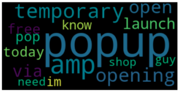

# SXSW Twitter Sentiment Prediction

Authors: Ashli Dougherty, Cameron Tavares, Kelly Mullaney

## Overview

***
## Business Problem
#### How do attendees feel about our company and products? 
Each March thousands of people attend the [South by Southwest (SXSW)](https://www.sxsw.com/) conference in Austin, Texas. This event features sessions, music and comedy showcases, film screenings, exhibitions, professional development and a variety of networking opportunities. This past year (2011) we debuted the iPad2 and instituted a pop-up store at the festival. We analyzed posts from social media platforms such as Twitter to get real time feedback on what participants liked and disliked about their experience and our new products. Using these Tweets we can further circulate the positive feedback and take the negative comments to our customer service and product development teams in order to improve user experience.

***
## Data
### Data Understanding
Our data was obtained from [Dataworld.com](https://data.world/crowdflower/brands-and-product-emotions) as a CSV file. This dataset contained approximately 9,000 prelabled tweets collected from the 2011 SXSW attendees as either having a positive, negative, or neutral sentiment about Apple, Google, or one of their products, application, or conference sessions. 
 
### Data Exploration
First, when cleaning the data we decided to drop the following values due to the total number of tweets in the dataset: 
- duplicate tweets (118 tweets) 
- any tweets that had a classified sentiment of “I can’t tell’ (156 tweets)

Next, we created a function that binned the data into general companies –  Apple or Google. Any data point that could be classified was dropped as it would not give us usable feedback on our products or services. Next we examined the overall sentiments of all tweets of both Apple and Google. 


**Initial takeaways**: 
- Apple has more mentions than Google overall.
- Of Tweets that had a sentiment, 39% were positive and only 8% were negative. 
- When we compare this our competitor, only 30% were positive tweets, but Google had overall fewer negative tweets (5% of total mentions).

We further filtered the data to keep tweets that were only relevant to Apple, separated them by sentiment, and created word clouds that showed us the most relevant words being used by participants. 

**Most Relevant Positive Words**


**Most Relevant Neutral Words**




**Most Relevant Negative Words**


Based on this we can see that participants were excited about the launch of the new iPad2 and the pop-up store at the conference. Neutral references mostly mention the existence of the pop-up store (likely new stories covering the opening of the store). 

There were three main topics for negative tweets. 
1. The battery life of their Apple products while using them during sessions at the conference
2. Poorly designed apps that caused "headaches"
3. That Apple is a “facist” company.  

***
## Methods
Built a custom transformer that works in Pipeline:
    1. makes an X_copy for safety reasons
    2. makes str and lowercase
    3. tokenizes with default RegexTokenizer
    4. tags tokens with POS and converts POS to wordnet
    5. Lemmatizes with default WordNetLemmatizer
    6. creates corpus via ' '.join(X_copy)
    7. vectorizes via default TfidfVectorizer
    8. sparse matrix object

Used classification models that would predict the sentiment of the tweet based on text. Using the pipeline all of the following models were implemented with default parameters. Accuracy, precision, and F1 scores for all models were printed and compared. 
- Dummy Classifier
- Nearest Neighbors
- Linear SVM
- RBF SVM
- Decision Tree
- Random Forest
- Bagging
- Gradient Boosting
- Neural Net
- AdaBoost
- MultiNomial Naive Bayes

***
## Modeling
After an initial test, the top three performing models that will be grid searched for best parameters and compared again are: 
  1. **RBF SVM** –  accuracy: 66%, precision: 66%, f1: 62%


  2. **Bagging** – accuracy: 62%, precision: 64%,  f1: 61%


  3. **Gradient Boosting**: accuracy: 64%, precision: 65%, f1: 59%


***
## Evaluation 
Even after grid searching the best performing model was still RBF SVM with default parameters as seen in our **Modeling** section.  

The model seems to be labeling positive tweets as neutral. This may be from human error as near duplicate tweets in the dataset were labeled with opposing sentiments between the train and test sets. As the majority of tweets are neutral, the model may be overtrained on neutral sentiments. As we saw from the word clouds, neutral and positive tweets have a lot of token overlap and context can be hard to decipher. 

*Example of duplicate tweets with differing sentiments*


However, the models did a decent job determining negative sentiments. These tweets are more helpful when it comes to customer service concerns and how we can better improve SXSW experinces and general Apple products. 

***
## Conclusions & Opportunites 
### Event Opportunities
Continue: 
- Continue the pop-up stores
- Continue product giveaways

Implement:
- Host party with special guests from Apple
    - Google had similar event and recieved much positive press/tweets

### Product Opporunities 
iWatch
- Smaller device that can help save iphone battery. 
- Can integrate navigation and fitness tracking. 

***
## Limitations & Next Steps
1. Our next steps would be to go back to the data and see if we could eliminate near duplicate tweets (these are tweets or retweets that are similar except the person mentioned) and to check the sentiment of the tweets. The initial sentiment of the tweets in this data set were labeled by humans and some of the near duplicate tweets have different sentiments causing some confusion in the model. 

2. Would like more tweets/data to run on the model to judge performance outside of this one event and see how it can be implemented for customer service. 

***
### For more information: 
Please review our full analysis in our [Jupyter Notebook](./code/piping_hot.ipynb) or our [presentation](./PresentationP4).

For any additional questions, please contact Cameron: tavarescameron1@gmail.com, Ashli: ashli.d.dougherty@gmail.com, or Kelly: mullaney.kelly.k@gmail.com 

### Repository Structure 
```
├── code                                   <- Narrative documentation of analysis in Jupyter notebook
├── data                                   <- Both sourced externally and generated from code
├── images                                 <- Both sourced externally and generated from code
├── DS_Project_Presentation.pdf            <- PDF version of project presentation
└── README.md                              <- The top-level README for reviewers of this project
```
